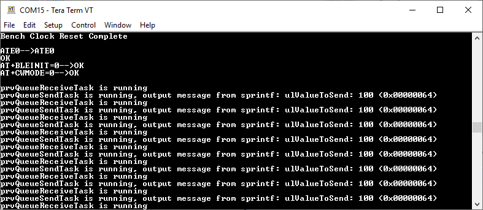

# hifive1-revb-freertos-printf

## SiFive HiFive1 Rev B - FreeRTOS
Example for using printf, sprintf on FreeRTOS

The project aims to implement printf, vprintf, sprintf, vsprintf functions which are used on FreeRTOS to print log to terminal with safe way

## Materials:
- SiFive HiFive 1 Rev B1 board
- Freedom Studio IDE tool
- Source code downloaded from https://github.com/TaLucGiaHoang/hifive1-revb-freertos-printf

## References:
The project was modified base on examples code of FreeRTOS demo for HiFive1 Rev B board.

Refer to FreeRTOS/Demo/RISC-V_RV32_SiFive_HiFive1_FreedomStudio on https://sourceforge.net/p/freertos/code/HEAD/tree/trunk/ (r2752)

## Usage
1. Copy **do_printf.h, do_printf.c, printf** files in **stdio** folder to another FreeRTOS project
2. Initialize uart0 peripheral to print terminal (see main.c)
3. Call printf or sprintf

